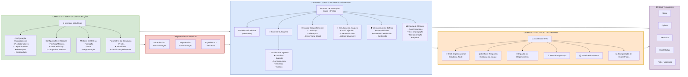

```mermaid
flowchart LR

%% =====================================================
%% DIGITAL TWIN - SOCIAL ENGINEERING SIMULATION PLATFORM
%% =====================================================

%% -----------------------------
%% INPUT LAYER
%% -----------------------------
subgraph L1["CAMADA 1 — INPUT / CONFIGURAÇÃO"]
direction TB

UI["🌐 Interface Web Mesa"]

CFG1["Configuração Organizacional
• Nº colaboradores
• Departamentos
• Hierarquias
• Escolaridade"]

CFG2["Configuração de Ataques
• Phishing Massivo
• Spear Phishing
• Campanhas Internas"]

CFG3["Medidas de Defesa
• Formação
• MFA
• Segmentação"]

CFG4["Parâmetros da Simulação
• Nº ticks
• Velocidade
• Cenários experimentais"]

UI --> CFG1
UI --> CFG2
UI --> CFG3
UI --> CFG4

end

%% -----------------------------
%% PROCESSING LAYER
%% -----------------------------
subgraph L2["CAMADA 2 — PROCESSAMENTO / ENGINE"]
direction TB

ENGINE["⚙️ Motor de Simulação
Mesa + Python"]

GRAPH["🌐 Rede Sociotécnica
(NetworkX)"]

AGENTS["👥 Sistema Multiagente"]

LOGIC["🧠 Lógica Comportamental
• Confiança
• Hierarquia
• Engenharia Social"]

ATTACK["🎯 Simulação de Ataques
• Email Injection
• Credential Theft
• Lateral Movement"]

DEFENSE["🛡️ Mecanismos de Defesa
• MFA Validation
• Awareness Reduction
• Contenção"]

METRICS["📊 Coleta de Métricas
• Comprometidos
• Taxa propagação
• Tempo deteção
• Impacto"]

STATES["🔄 Estados dos Agentes
• Saudável
• Exposto
• Comprometido
• Detetado
• Isolado"]

ENGINE --> GRAPH
ENGINE --> AGENTS
ENGINE --> LOGIC
ENGINE --> ATTACK
ENGINE --> DEFENSE
ENGINE --> METRICS
AGENTS --> STATES

end

%% -----------------------------
%% OUTPUT LAYER
%% -----------------------------
subgraph L3["CAMADA 3 — OUTPUT / DASHBOARD"]
direction TB

DASH["📈 Dashboard Web"]

VIS1["📍 Grafo Organizacional
Estado da Rede"]

VIS2["📊 Gráficos Temporais
Evolução do Ataque"]

VIS3["🏢 Impacto por Departamento"]

VIS4["⚠️ KPIs de Segurança"]

VIS5["🕒 Timeline de Eventos"]

VIS6["📉 Comparação de Experiências"]

DASH --> VIS1
DASH --> VIS2
DASH --> VIS3
DASH --> VIS4
DASH --> VIS5
DASH --> VIS6

end

%% -----------------------------
%% FLOW BETWEEN LAYERS
%% -----------------------------
L1 --> L2
L2 --> L3

%% -----------------------------
%% EXPERIMENTS
%% -----------------------------
subgraph EXP["🧪 Experiências Académicas"]
direction TB

E1["Experiência 1
Sem Formação"]

E2["Experiência 2
50% Formação"]

E3["Experiência 3
MFA Ativo"]

end

L1 --> EXP
EXP --> L2

%% -----------------------------
%% TECHNOLOGY STACK
%% -----------------------------
subgraph TECH["💻 Stack Tecnológica"]
direction LR

T1["Mesa"]
T2["Python"]
T3["NetworkX"]
T4["ChartModule"]
T5["Plotly / Matplotlib"]

end

L2 --> TECH
L3 --> TECH

%% -----------------------------
%% STYLING
%% -----------------------------
style L1 fill:#d5e8d4,stroke:#82b366,stroke-width:2px
style L2 fill:#dae8fc,stroke:#6c8ebf,stroke-width:2px
style L3 fill:#ffe6cc,stroke:#d79b00,stroke-width:2px
style EXP fill:#f8cecc,stroke:#b85450,stroke-width:2px
style TECH fill:#e1d5e7,stroke:#9673a6,stroke-width:2px
```
