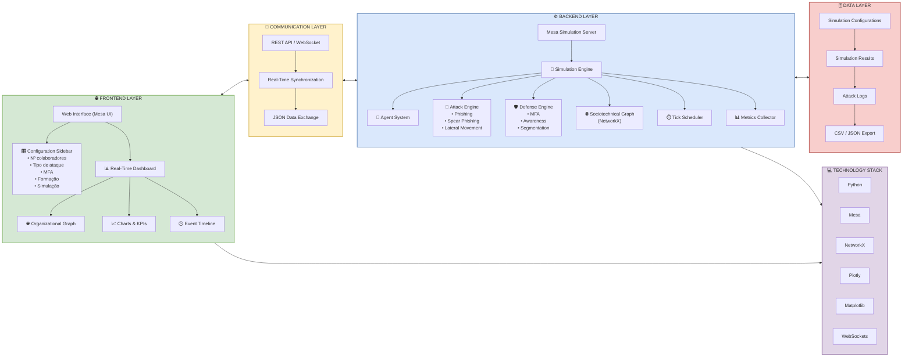

```mermaid
flowchart LR

%% =====================================================
%% DIGITAL TWIN PLATFORM - BACKEND / FRONTEND ARCHITECTURE
%% =====================================================

%% -----------------------------
%% FRONTEND
%% -----------------------------
subgraph FRONT["🌐 FRONTEND LAYER"]
direction TB

WEB["Web Interface (Mesa UI)"]

SIDEBAR["🎛️ Configuration Sidebar
• Nº colaboradores
• Tipo de ataque
• MFA
• Formação
• Simulação"]

DASH["📊 Real-Time Dashboard"]

GRAPH["🌐 Organizational Graph"]

CHARTS["📈 Charts & KPIs"]

EVENTS["🕒 Event Timeline"]

WEB --> SIDEBAR
WEB --> DASH
DASH --> GRAPH
DASH --> CHARTS
DASH --> EVENTS

end

%% -----------------------------
%% API / COMMUNICATION
%% -----------------------------
subgraph API["🔌 COMMUNICATION LAYER"]
direction TB

REST["REST API / WebSocket"]

SYNC["Real-Time Synchronization"]

JSON["JSON Data Exchange"]

REST --> SYNC
SYNC --> JSON

end

%% -----------------------------
%% BACKEND
%% -----------------------------
subgraph BACK["⚙️ BACKEND LAYER"]
direction TB

SERVER["Mesa Simulation Server"]

ENGINE["🧠 Simulation Engine"]

AGENTS["👥 Agent System"]

ATTACKS["🎯 Attack Engine
• Phishing
• Spear Phishing
• Lateral Movement"]

DEFENSE["🛡️ Defense Engine
• MFA
• Awareness
• Segmentation"]

GRAPHMODEL["🌐 Sociotechnical Graph
(NetworkX)"]

SCHEDULER["⏱️ Tick Scheduler"]

METRICS["📊 Metrics Collector"]

SERVER --> ENGINE
ENGINE --> AGENTS
ENGINE --> ATTACKS
ENGINE --> DEFENSE
ENGINE --> GRAPHMODEL
ENGINE --> SCHEDULER
ENGINE --> METRICS

end

%% -----------------------------
%% DATA STORAGE
%% -----------------------------
subgraph DATA["🗄️ DATA LAYER"]
direction TB

CONFIG["Simulation Configurations"]

RESULTS["Simulation Results"]

LOGS["Attack Logs"]

EXPORT["CSV / JSON Export"]

CONFIG --> RESULTS
RESULTS --> LOGS
LOGS --> EXPORT

end

%% -----------------------------
%% TECHNOLOGY STACK
%% -----------------------------
subgraph STACK["💻 TECHNOLOGY STACK"]
direction LR

S1["Python"]
S2["Mesa"]
S3["NetworkX"]
S4["Plotly"]
S5["Matplotlib"]
S6["WebSockets"]

end

%% -----------------------------
%% FLOW
%% -----------------------------
FRONT <--> API
API <--> BACK
BACK <--> DATA

BACK --> STACK
FRONT --> STACK

%% -----------------------------
%% STYLES
%% -----------------------------
style FRONT fill:#d5e8d4,stroke:#82b366,stroke-width:2px
style API fill:#fff2cc,stroke:#d6b656,stroke-width:2px
style BACK fill:#dae8fc,stroke:#6c8ebf,stroke-width:2px
style DATA fill:#f8cecc,stroke:#b85450,stroke-width:2px
style STACK fill:#e1d5e7,stroke:#9673a6,stroke-width:2px
```
